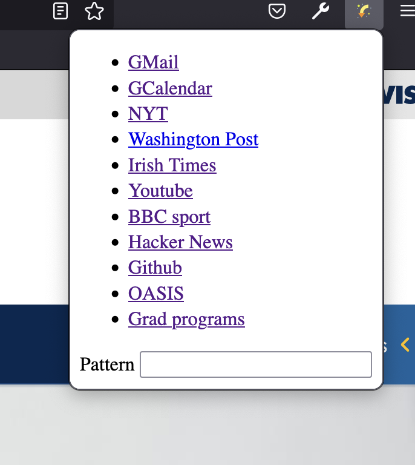

## JumpToOrOpen

This is another effort to manage tabs.

The aim here is to avoid opening a tab for a commonly visited URL
when we already have a tab for that URL.

We change how we open the tab by using
+ a pull-down menu or 
+ key bindings for these common URLs.

Additionally, the pull-down menu has a text field
to specify any matching part of a URL or title
to find.

The key bindings are currently
+ gradProgs: MacCtrl+G
+ oasis: MacCtrl+O
+ prm: MacCtrl+P
+ gmail: MacCtrl+E
+ calendar: MacCtrl+L
+ nytimes: MacCtrl+Y
+ washpost: MacCtrl+W

The pull-down menu is 

## Extending

To add key bindings, 
+ add the shortcut in the manifest.json with a label
+ an entry in hotkeys.js using the label and an array `[ url, exact ]` where `exact` is `true` or
  `false`.
  + the url can be a regular expression

